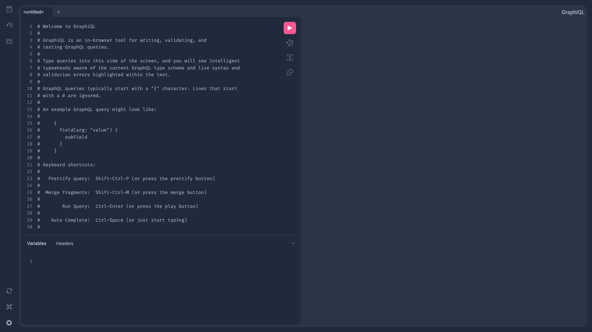
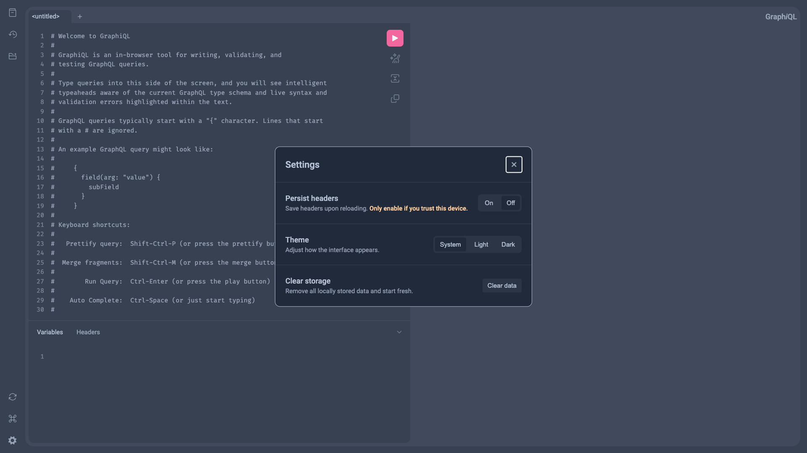

# 🚀 graphql-playground-docker

A minimal Docker image for running [GraphQL Playground](https://github.com/graphql/graphiql) — served efficiently with Go, no Node.js needed.

> Forked from [mkrou/graphql-playground-docker](https://github.com/mkrou/graphql-playground-docker)

Spin up a full-featured GraphQL UI with a single Docker command.

---

## 🧪 Features

* 🔌 Bring your own GraphQL endpoint via env or URL param
* ⚡️ Fast, lightweight, production-ready
* 🐳 Easy to deploy with Docker (no need for Node/npm)
* 🎨 Customizable title via environment variable

---

## 📆 Usage

```bash
docker run --name graphql-playground -d \
  -e HOST=http://localhost:3003/graphql \
  -e TITLE="My GraphQL Explorer" \
  -e PORT=8080 \
  -p 8080:8080 \
  triasbrata/graphql-playground-docker
```

Then open [http://localhost:8080](http://localhost:8080) in your browser.

---

## 🔧 Environment Variables

| Name    | Description                                 | Default                         |
| ------- | ------------------------------------------- | ------------------------------- |
| `HOST`  | The target GraphQL endpoint URL             | `http://localhost:9000/graphql` |
| `TITLE` | The title shown in the Playground UI        | `GraphQL Playground`            |
| `PORT`  | The port to serve Playground on (container) | `8080`                          |

> You can also override the endpoint directly in the browser using a query param:
> 👉 `http://localhost:8080?url=http://localhost:3003/graphql`

---

## 🛠 Example with Docker Compose

```yaml
services:
  playground:
    image: triasbrata/graphql-playground-docker
    ports:
      - 8080:8080
    environment:
      - HOST=http://your-backend/graphql
      - TITLE=Playground UI
```

---

## 📁 Project Structure

* Go server using `html/template`
* ESM-only static frontend using React + GraphiQL
* Customizable via env or URL

---

## 🧊 Screenshot


---

## 📃 License

MIT © [triasbrata](https://github.com/triasbrata)
